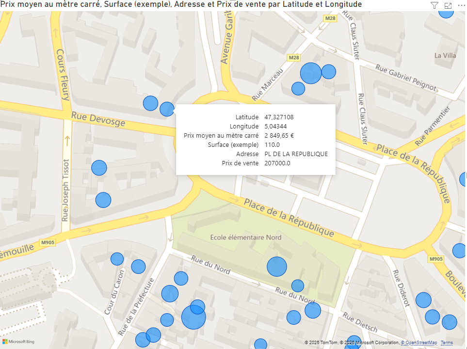

# Analyse du Marché Immobilier - Dijon (ETL & BI)

Ce projet personnel réalise un pipeline **ETL** (Extract, Transform, Load) complet pour analyser les prix de l'immobilier à Dijon en utilisant les données de l'État (**DVF - Demandes de Valeurs Foncières**).

## Objectifs du Projet
- Automatiser la récupération des données Open Data (API Etalab).
- Nettoyer et filtrer un jeu de données massif pour l'isoler sur une zone géographique (Dijon).
- Traiter les valeurs aberrantes pour garantir la fiabilité des analyses.
- Créer un dashboard interactif pour visualiser le prix au m² par quartier/rue.

## Stack Technique
- **Python 3.12** : Langage principal.
- **Pandas** : Manipulation et nettoyage des données.
- **Requests** : Extraction des données via flux HTTP.
- **Power BI** : Modélisation des données et dataviz cartographique.
- **Git/GitHub** : Versioning du code.

## Architecture du Pipeline

### 1. Extraction (`extract.py`)
Le script récupère automatiquement le fichier CSV compressé du département de la Côte-d'Or (21) pour l'année 2023. L'écriture est optimisée par "chunks" pour limiter l'empreinte mémoire (RAM).

### 2. Transformation (`transform.py`)
C'est le cœur du projet. Les étapes clés sont :
- **Filtrage** : Conservation des transactions à Dijon uniquement.
- **Typage** : Exclusion des ventes de terrains, dépendances ou locaux commerciaux (focus : Appartements/Maisons).
- **Calculs** : Création de la colonne `prix_m2` (Valeur foncière / Surface réelle).
- **Nettoyage des Outliers** : Suppression des données aberrantes (ex: ventes < 500€/m² ou > 10 000€/m²) pour assainir la visualisation.

### 3. Visualisation (Power BI)
Importation du fichier `dijon_immobilier_propre.csv`.
- **Géolocalisation** : Paramétrage des colonnes Latitude/Longitude.
- **Interactivité** : Infobulles personnalisées affichant l'adresse exacte, la surface et le prix final.

## Installation et Utilisation

1. **Cloner le projet**
   ```bash
   git clone [https://github.com/TON_PSEUDO/dvf-dijon-etl-powerbi.git](https://github.com/TON_PSEUDO/dvf-dijon-etl-powerbi.git)
   cd dvf-dijon-etl-powerbi

2. **Préparer l'environnement**
   ```bash
   python -m venv env
   source env/bin/activate  # Sur Windows: .\env\Scripts\activate
   pip install pandas requests

3. **Lancer le pipeline**
   ```bash
   python extract.py
   python transform.py

4. **Visualuser**
   Ouvrir le fichier .pbix (ou importer le CSV généré dans data/) avec Power BI Desktop.

## Aperçu du Dashboard

Voici le résultat final obtenu dans Power BI, illustrant la répartition des prix moyens au mètre carré à Dijon :


